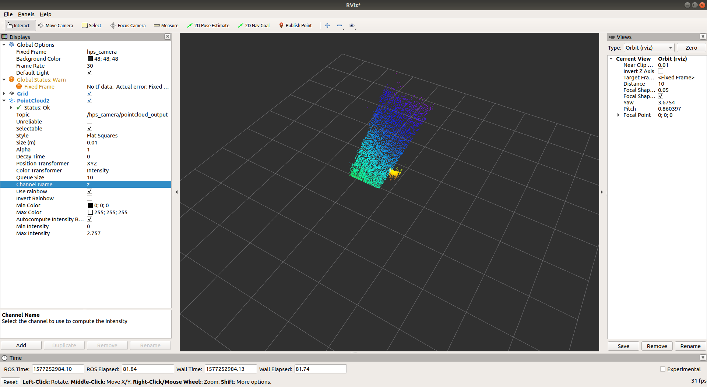

[](https://opensource.org/licenses/MIT)

# Hypersen HPS-3D160 Solid-State Lidar ROS package #
## Preparation ##
- Check if the device is recognized correctly or not
```bash
    ls /dev/ttyACM*
    # You should see /dev/ttyACM[device number; eg: 0 or 1] if the device has been recognized
```
- Give permission to access the device
```bash
    ls /dev/ttyACM* | xargs sudo chmod 666
    # After that cat /dev/ttyACM[device number; eg: 0 or 1] should give you a blank output
```

## How to Run ##
- Build this ROS package
- Run the launch file
```bash
    roslaunch hps_camera hps_camera.launch
```
- Subscribe to the pointcloud topic to get the point cloud
```bash
    rostopic info /hps_camera/pointcloud_output
```

Info:

```
Type: sensor_msgs/PointCloud2

Publishers:
 * /hps_camera/ros_camera_client

Subscribers: None
```

## Sample ##

